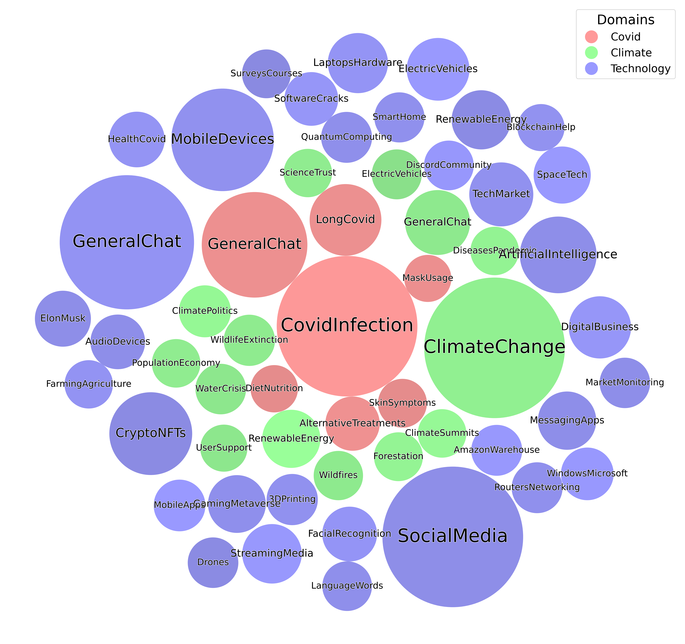

# Reddit Data Collection & Topic-Based Preprocessing Pipeline

A Python-based pipeline for collecting, cleaning, and semantically organizing large-scale Reddit discussions. The pipeline downloads raw Reddit data, filters and preprocesses posts and comments, detects low-quality or automated activity, and applies topic modeling to produce structured, topic-aware datasets for downstream analysis and simulation.

## 🌟 Overview


**Figure 1:** Methodological pipeline for constructing an empirically grounded agent-based simulation dataset from Reddit interactions.

This repository contains a sequential data processing pipeline that transforms raw Reddit data into a high-quality, topic-annotated dataset. The pipeline is fully configurable via a central `config.json` file and supports multiple domains such as **COVID-19**, **Climate Change**, or custom subreddit collections.

The final dataset consists of cleaned Reddit posts and comments that are:
- Filtered by time range
- Filtered for bot-like or low-quality activity
- Size-controlled for efficient processing
- Annotated with semantic topic labels

## 🧩 Pipeline Stages

### 1️⃣ Reddit Data Collection

**Script:** `1-RedditDataCollection.py`

- Downloads selected subreddit data from a large Reddit torrent using `libtorrent`
- Supports predefined datasets (`covid`, `climate`) or custom subreddit lists
- Estimates dataset size before download
- Decompresses `.zst` files into `.jsonl` format
- Filters posts and comments by a configurable date range
- Groups comments under their corresponding posts

**Output:**
- `data/<dataset>_grouped.jsonl`

---

### 2️⃣ Data Preprocessing & Bot Filtering

**Script:** `2-DataPreprocessing.py`

- Loads grouped post–comment data
- Detects potential bot accounts based on repetitive comment patterns
- Removes posts containing bot-generated comments or deleted content
- Trims comments to a fixed maximum number per post
- Produces a compact, cleaned dataset

**Output:**
- `data/<dataset>_grouped_preprocessed.jsonl`

---

### 3️⃣ Topic Modeling & Semantic Annotation

**Script:** `3-InteractionExtraction.py`

- Applies BERTopic jointly to posts and comments
- Assigns topic IDs to each post and comment
- Extracts representative keywords for each topic
- Computes topic-level statistics (posts and comments per topic)
- Filters out low-frequency topics based on a configurable threshold
- Replaces author identifiers with topic-based labels for anonymized interaction modeling

**Outputs:**
- Topic-annotated dataset:
  - `data/<dataset>_grouped_preprocessed_wtopics.json`
- Topic-filtered dataset:
  - `data/<dataset>_grouped_preprocessed_wtopics_filtered.jsonl`
- Topic metadata:
  - `*_topics_with_keywords.csv`
  - `*_topics_stats.csv`
  - `*_topics_names.csv`

---

### 4️⃣ Automated Pipeline Execution

**Script:** `run_pipeline.py`

Runs all processing stages sequentially in the correct order:

```bash
python run_pipeline.py
```

The pipeline stops automatically if an error occurs in any stage.

## ⚙️ Configuration

All pipeline parameters are defined in `config.json`, including:
- Dataset selection (`covid`, `climate`, `custom`)
- Custom subreddit lists
- Date range filtering
- Topic filtering thresholds

This enables reproducible experiments across different domains and time periods.

## 📂 Project Structure

```
.
├── 1-RedditDataCollection.py      # Download, decompress, and group Reddit data
├── 2-DataPreprocessing.py         # Bot detection and dataset cleanup
├── 3-InteractionExtraction.py     # Topic modeling and semantic annotation
├── run_pipeline.py                # Sequential pipeline execution
├── config.json                    # Central configuration file
├── torrent/                       # Reddit torrent files
└── data/                          # Generated datasets and metadata
```

## 🛠️ Technology Stack

- Python 3
- libtorrent
- zstandard
- BERTopic
- scikit-learn
- pandas
- tqdm

## 🎯 Intended Use



**Figure 2:** Visualization of all agents: 33 technology-focused, 14 climate-focused, and 7 COVID-related agents.

This pipeline is intended for research use cases such as:
- Social media discourse analysis
- Topic-based interaction modeling
- Data preprocessing for simulations or network analysis
- Large-scale analysis of online discussions

## 📝 License

This code is intended for research purposes. Please ensure compliance with Reddit’s data usage policies when using the datasets.

## 🙏 Acknowledgments

This work is supported by **TWON** (project number **101095095**), a research project funded by the European Union under the **Horizon Europe** framework (HORIZON-CL2-2022-DEMOCRACY-01, Topic 07).

More information about the project is available on the official website:
👉 https://www.twon-project.eu/
